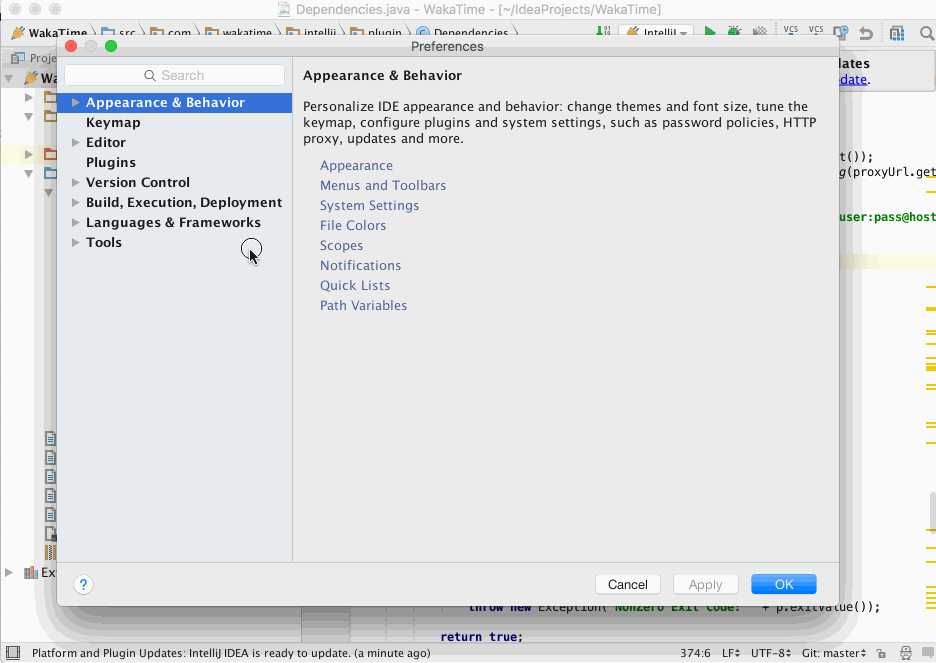

# jetbrains-wakatime

[WakaTime][wakatime] is an open source Jetbrains plugin for metrics, insights, and time tracking automatically generated from your programming activity.

Supports Jetbrains IDES:

* [Android Studio][android studio]
* [AppCode][appcode]
* [CLion][clion]
* [DataGrip][datagrip]
* [GoLand][goland]
* [IntelliJ IDEA][wakatime]
* [PhpStorm][phpstorm]
* [PyCharm][pycharm]
* [Rider][rider]
* [RubyMine][rubymine]
* [WebStorm][webstorm]

## Installation

1. Inside your IDE, select `Preferences → Plugins`.

2. Search for `WakaTime`.

3. Click the green `Install` button.

4. Re-launch your IDE.

5. Enter your [api key](https://wakatime.com/settings#apikey) in `Tools → WakaTime API Key`, then click `Save`.

6. Use your IDE and your coding activity will be displayed on your [WakaTime dashboard](https://wakatime.com).

## Screen Shots

## Configuring

WakaTime for Jetbrains IDE's can be configured via Tools → WakaTime Settings.

For more settings, WakaTime plugins share a common config file `.wakatime.cfg` located in your user home directory with [these options](https://github.com/wakatime/wakatime-cli/blob/develop/USAGE.md) available.

## Uninstalling

Inside your IDE, select `Preferences → Plugins`, then find the `WakaTime` plugin. Click `Uninstall`. Then delete your `~/.wakatime.cfg` config file.

## Troubleshooting

If you’re using a proxy, try excluding `*.wakatime.com` from using your IDE proxy:

Next, turn on debug mode from `Tools → WakaTime Settings`. Then restart your IDE.

Note: If the plugin wasn’t loaded, you won’t have a WakaTime Settings menu.
In that case, check for error messages in your IDE’s `idea.log` file indicating why the plugin couldn’t load.

Check your IDE’s `idea.log` file for WakaTime related messages:

`Help → Show Log` ( [Locating your idea.log file](https://intellij-support.jetbrains.com/hc/en-us/articles/207241085-Locating-IDE-log-files) )

For more general troubleshooting information, see [WakaTime CLI Troubleshooting](https://github.com/wakatime/wakatime-cli/blob/develop/TROUBLESHOOTING.md).

[wakatime]: https://wakatime.com/
[IntelliJ IDEA]: https://wakatime.com/intellij-idea
[Android Studio]: https://wakatime.com/android-studio
[AppCode]: https://wakatime.com/appcode
[CLion]: https://wakatime.com/clion
[DataGrip]: https://wakatime.com/datagrip
[GoLand]: https://wakatime.com/goland
[PhpStorm]: https://wakatime.com/phpstorm
[PyCharm]: https://wakatime.com/pycharm
[Rider]: https://wakatime.com/rider
[RubyMine]: https://wakatime.com/rubymine
[WebStorm]: https://wakatime.com/webstorm

